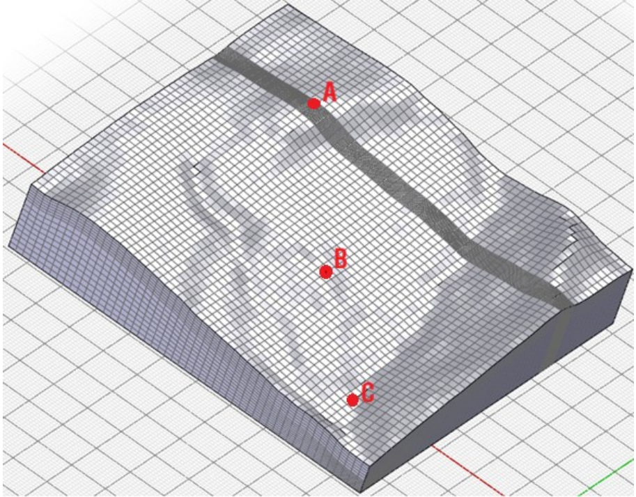
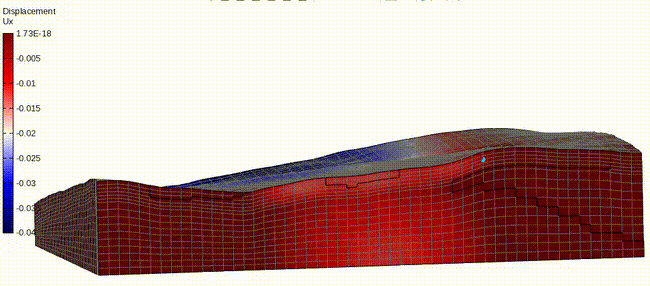
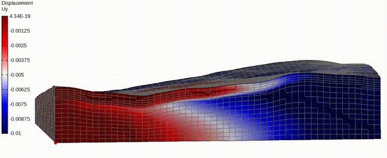
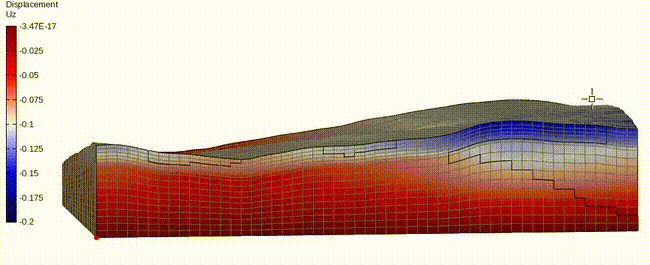
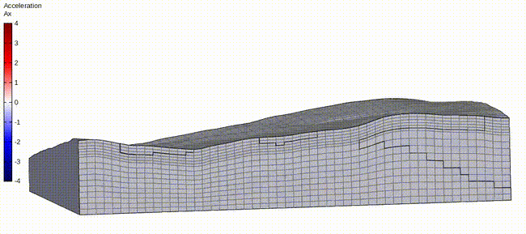
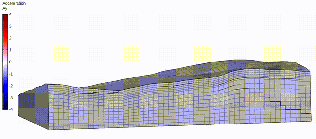

# **POLITECNICO DI BARI** - **DRSATE XXXVIII PhD cycle**
## **Tutors:** F. Cotecchia, G. Elia, A. di Lernia
## **Author:** GIANLUCA CAVALLO 
## **start year: 2023**
## **email:** gi.cav.2586@gmail.com
## **email:** g.cavallo@phd.poliba.it

In the following lines are presented some animated result obtained with the resolution of a 3D FEM moded with 90 CPUs in an HPC system:
# Global contour results 
## Deformed mesh

## Displacements in x directions

## Displacements in y directions

## Displacements in z directions

## Accelerations in X directions

## Accelerations in y directions

# Points A B C

# Surface point B output

# Section for A point

## Displacements in x directions

## Displacements in y directions

## Displacements in z directions

## Accelerations in x directions

## Accelerations in y directions

